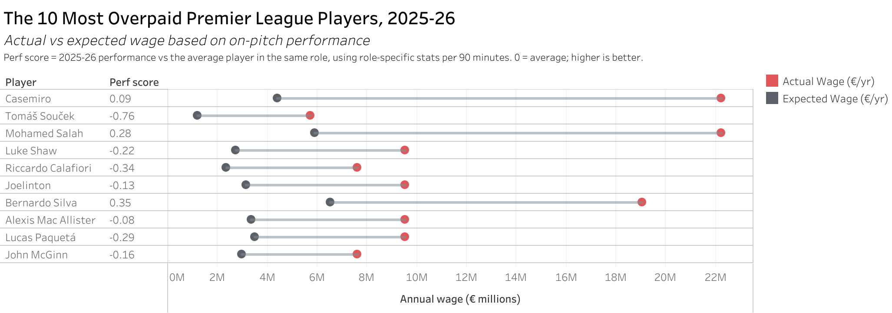
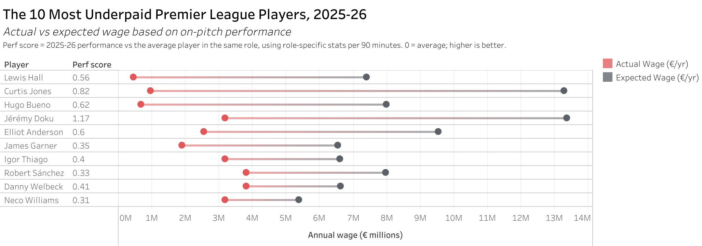

# Do Premier League Wages Track Performance?

Which Premier League players are paid far more, or far less, than their 2025-26 on-pitch performance suggests?

**Interactive dashboard:** <https://public.tableau.com/app/profile/aman.kassa/viz/WagesvsPerformance/WagesvsPerformance#1>

 


## Key findings

- **Performance and pay are only loosely linked.** Across 148 regular starters, the correlation between performance score and wage is about 0.3.
- **Established stars are paid for status, not current output.** Casemiro (5.1x), Souček (4.8x) and Salah (3.8x) earn several times what their 2025-26 performance suggests.
- **Young breakout players are the biggest bargains.** Lewis Hall, Curtis Jones and Hugo Bueno earn under 10% of their performance-based wage. Most of the top 10 underpaid players were 23 or younger, still on contracts signed before their breakout.

## How it works

1.  **Combine three sources.** Match stats, Transfermarkt positions and wage estimates are joined by player name. Players are only matched to a wage **at the same club**, so wages from a previous club don't skew results.
2.  **Assign a detailed role.** Each player gets one of 6 roles (goalkeeper, centre-back, full-back, central/defensive mid, winger/attacking mid, striker), with manual fixes where Transfermarkt's position didn't match how the player was used.
3.  **Build a performance score.** For each role, I chose the stats that matter most (for example goals and xG for strikers, interceptions and aerial duels for centre-backs), converted them to per-90 rates and compared each player with others in his role. Core stats are weighted 2-3x.
    - Penalty goals and penalty xG are removed, so penalty takers don't get easy credit
    - Scores are pulled toward average for players with fewer minutes, since a strong half-season is less certain than a strong full season
4.  **Estimate expected wage.** Within each role, a player who performs X steps above the role average is expected to earn X steps above the role's average wage, scaled down by half to stay conservative.
5.  **Rank over- and underpaid players** by `actual wage ÷ expected wage`.

**Perf score:** 2025-26 performance vs the average player in the same role. 0 = average, higher is better.

## Limitations

- Wages are **2024-25 estimates**, not official figures. Players who changed clubs were excluded.
- Stats are not adjusted for team possession, so defenders on dominant teams may be underrated.
- Wages also reflect reputation, commercial value and contract timing, which on-pitch stats can't capture. True outliers like Haaland have no comparable player, so their expected wage is likely too low.
- Only players with 1,500+ minutes are judged, so injured players are left out.
- Superstars like Haaland have no comparable peer in the data, so their expected wage is likely understated.

## Data sources

- Player stats: [EPL 2025-26 Player Stats (Kaggle)](https://www.kaggle.com/datasets/sananmuzaffarov/epl-202526-player-stats-gw131)
- Positions: [Football Data from Transfermarkt (Kaggle)](https://www.kaggle.com/datasets/davidcariboo/player-scores)
- Wages: [2025 Premier League: Stats, Matches, Salaries (Kaggle)](https://www.kaggle.com/datasets/flynn28/2025-premier-league-stats-matches-salaries)

## Files

```         
wage_vs_performance.ipynb               full analysis, run top to bottom
data/raw/player_stats_2025_26.csv       match stats up to GameDay 35
data/raw/player_salaries.csv            wage estimates
data/raw/player_roles_transfermarkt.csv detailed positions
data/output/tableau_players.csv         results used in the dashboard
data/output/tableau_wage_drivers.csv    stats most linked to higher wages
```

## Run it

``` bash
pip install -r requirements.txt
jupyter lab
```

Open `wage_vs_performance.ipynb` and run all cells.

**Tools:** Python (pandas, NumPy), Jupyter, Tableau Public
